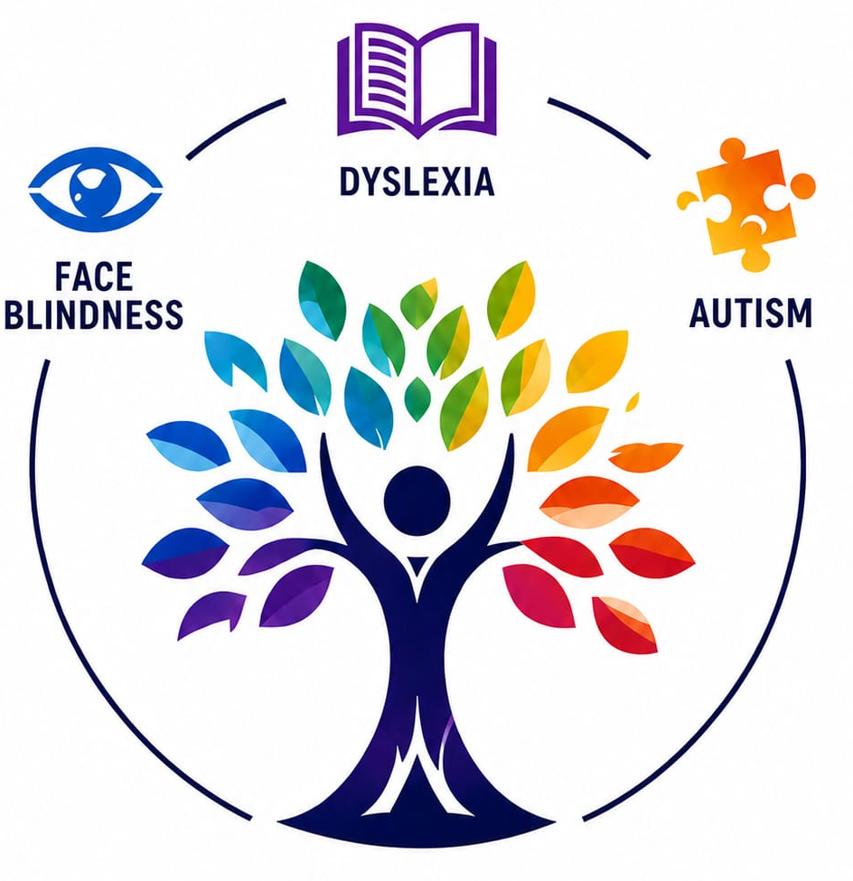

# 🌈 PRISM: Personalized Real-time Intelligent Support Module
### Adaptive Accessibility Platform for Dyslexia & Face Blindness (Prosopagnosia)
> **Capgemini x Synchrony Hackathon Innovation | Team 7 - Tech Titans**

---

<p align="center">
  
</p>

<p align="center">
  <b>"One App. Two Specialized Profiles. Personalized for Every Mind."</b>
</p>

<p align="center">
  <a href="#key-features"></a>
  <a href="#architecture"></a>
  <a href="#frontend"></a>
  <a href="#license"></a>
</p>

---

## 📌 Problem & Vision

Neurodivergent individuals frequently face fragmented tools:
- **Dyslexia**: Reading fatigue, slow decoding fluency, letter reversals ($b \leftrightarrow d$, $p \leftrightarrow q$).
- **Face Blindness (Prosopagnosia)**: Inability to recognize familiar faces, colleagues, classmates, and social settings.

**PRISM** unifies cognitive support into an adaptive platform that morphs its UI, typography, computer vision features, and assistive AI specifically for each condition.

---

## 🚀 Key Modules & Capabilities

### 1. 📖 Dyslexia Mode (Purple Theme)
- **Dyslexia-Optimized Typography**: Native support for *OpenDyslexic*, *Lexend*, and *Atkinson Hyperlegible* fonts.
- **Bionic Reading Mode**: Algorithmic bolding of word prefixes to guide saccadic eye movements.
- **Syllable Tinting**: Color-coded syllable breakdown for improved decoding.
- **Interactive Reading Ruler**: Mouse-tracking focus ruler to reduce visual crowding.
- **Background Comfort Overlays**: Irlen-syndrome color tints (*Cream*, *Peach*, *Mint*, *Lavender*, *Dark*).
- **Karaoke Text-to-Speech**: Real-time speech synthesis with live word-by-word visual highlight tracking.
- **NLP Text Simplifier**: Transforms dense academic paragraphs into *Simpler*, *Shorter*, or *Bullet Format* with readability metrics.
- **Scan & Read (OCR)**: Extracts and reads text from whiteboard snapshots and printed handouts.

### 2. 👁️ Face Blindness (Prosopagnosia) Mode & OpenCV Engine (Blue Theme)
- **OpenCV Computer Vision Face Scanner**: Powered by **OpenCV 5.0** (`cv2`) with real-time skin segmentation, contour detection, and bounding box localization.
- **Multi-Source Scanning**: Supports **Live Webcam Video Streams**, **Custom Photo Uploads**, and **Contact Presets**.
- **Live OpenCV Telemetry**: Real-time HUD showing localized face coordinates, eye tracking, expression/smile indicators, and match confidence scores ($98\%+$).
- **Memory Cue Cards**: Detailed profiles with distinctive visual anchors (*"Rectangular black-rimmed glasses"*, *"Neat brown hair"*, *"Navy blue collared shirts"*), voice clues, and conversation reminders.
- **Memory Reinforcement Flashcard Quiz**: Interactive practice game testing face-cue associations with points and reward streaks.

### 3. 🌐 Accessibility Platform Hub
- **PRISM AI Copilot**: Multi-modal conversational assistant with microphone Speech-to-Text (STT) and profile-aware prompt intelligence.
- **WCAG 2.1 AAA Accessibility Suite**: Font size scaling, high-contrast mode, line spacing, and color-blindness simulation filters (*Protanopia*, *Deuteranopia*, *Tritanopia*).
- **Global Prevalence Analytics**: Interactive data visualization of global populations (800M Dyslexia, 200M Prosopagnosia) and overlap rates.
- **Platform Architecture Explorer**: Visual breakdown of the engineering stack.

---

## 🏗️ Architecture

```
                                  +------------------------------------+
                                  |    PRISM Frontend (React 18 SPA)   |
                                  |   Adaptive UI / Theme Engine / PWA  |
                                  +------------------+-----------------+
                                                     |
                                            REST API / Web Speech
                                                     |
                                  +------------------v-----------------+
                                  |      FastAPI Backend Gateway       |
                                  +------------------+-----------------+
                                                     |
                             +-----------------------+-----------------------+
                             |                                               |
                +------------v------------+                     +------------v------------+
                |   Dyslexia NLP Engine   |                     |   OpenCV Vision Engine  |
                | (Simplifier, Syllables) |                     |    (Haar / Contours)    |
                +-------------------------+                     +-------------------------+
                             |                                               |
                             +-----------------------+-----------------------+
                                                     |
                                  +------------------v-----------------+
                                  |   Persistent JSON / SQLite Store   |
                                  +------------------------------------+
```

---

## 📦 Getting Started & Running Locally

### Prerequisites
- **Python 3.10+** (Python 3.12 recommended)
- Modern web browser (Chrome / Edge / Firefox)

### 1. Clone the Repository
```bash
git clone https://github.com/nikhilpabbu/PRISM.git
cd PRISM
```

### 2. Install Dependencies
```bash
pip install fastapi uvicorn opencv-python pydantic requests pillow supabase
```

### 3. Supabase Cloud Configuration (Optional / Included)
PRISM connects to Supabase out of the box with default credentials:
- **Supabase URL**: `https://txnpyqtopqdeclicefod.supabase.co`
- **Publishable Key**: `sb_publishable_gqmIo1pGUjD_SV1uXT-m8w_YTVhWH4D`
- **Postgres DDL Schema**: Located at `backend/supabase_schema.sql`

To link via Supabase CLI:
```bash
supabase login
supabase link --project-ref txnpyqtopqdeclicefod
supabase db push
```

### 4. Launch the Application Server
```bash
python backend/main.py
```

### 5. Access the Web Application
Open your browser and navigate to:
```
http://localhost:8000
```
- Tap **"Log In"** in the top navigation bar to create an account or sign in via Supabase cloud auth.
- Use **"Continue as Demo Guest"** for instant 1-click evaluation.

---

## 👥 Team 7 - Tech Titans (Capgemini x Synchrony)

- **Charmi Reddy P**
- **Malavika Manga**
- **Aarthi Pasare**
- **Nikhil Pabbu**
- **Aranagi Sravan Kumar**

**Mentors**: Rajesh Narayan • Siva Prashad • Ajay Goud

---

## 📄 License
This project is licensed under the MIT License.
